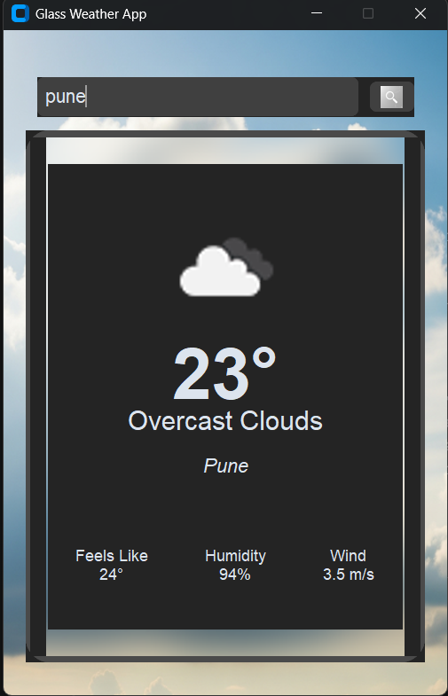

# Glassmorphism Weather App

A sleek and modern desktop weather application with a beautiful glassmorphism design. It provides real-time weather information for any city, featuring dynamic backgrounds that change according to the current weather conditions and time of day.

## Features

-City-Based Weather Search
-Dynamic Backgrounds

-Glassmorphism UI

-Smooth Animations

-Information about current :-

1)Temperature (°C)

2)"Feels Like" Temperature

3)Weather Conditions (e.g., "Clear Sky", "Light Rain")

4)Humidity

5)Wind Speed

## Tech Uesd
CustomTkinter: For the modern graphical user interface.

Pillow (PIL): Used for image processing to create the glass effect and handle icons.

Requests: For making API calls to the OpenWeatherMap service.

OpenWeatherMap API: As the source for weather data.

